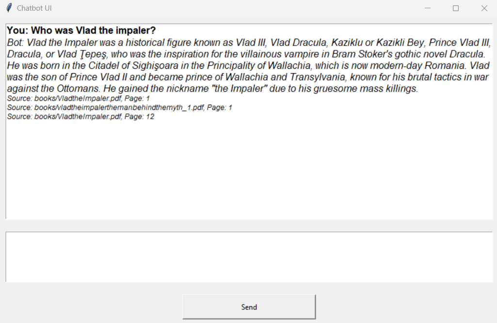
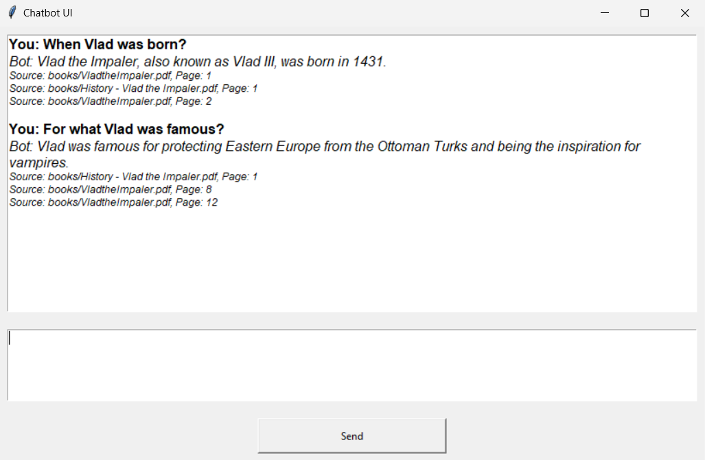
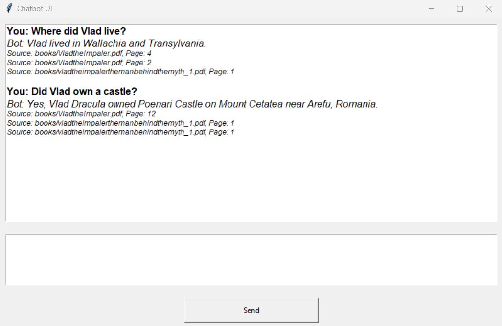

# RAG application

In this project, I have created a chatbot using the RAG model. The chatbot is a simple UI that allows the user to ask questions and get answers from the RAG model. The RAG model is a retrieval-augmented generation model that can be used to generate answers to questions. The model uses a retriever to find relevant documents chunks and then generates an answer based on the retrieved documents.
To deploy the chatbot, I have created a docker image that contains the chatbot engine and is accessible with a API request. The docker image can be run on any machine that has docker installed. The chatbot uses the OpenAI API to generate answers to questions. The OpenAI API requires an API key to access the model. The API key can be obtained by signing up for the OpenAI API. The API key is passed to the chatbot using an environment variable. The chatbot uses the API key to access the OpenAI API and generate answers to questions.

To build the docker image, run the following command:

```bash
docker build -t mychatbot . 
```

To run the docker image, run the following command and replace YOUR KEY with your OpenAI key:

```bash
docker run -d -p 5000:5000 -e OPENAI_API_KEY=YOUR_KEY mychatbot
```

To access the chatbot run the following command:

```bash
python ui_client.py
```

If you want to run the app without docker, you can run the following command:

```bash
python ui_app_without_server.py
```

Some examples of the chatbot in action:




